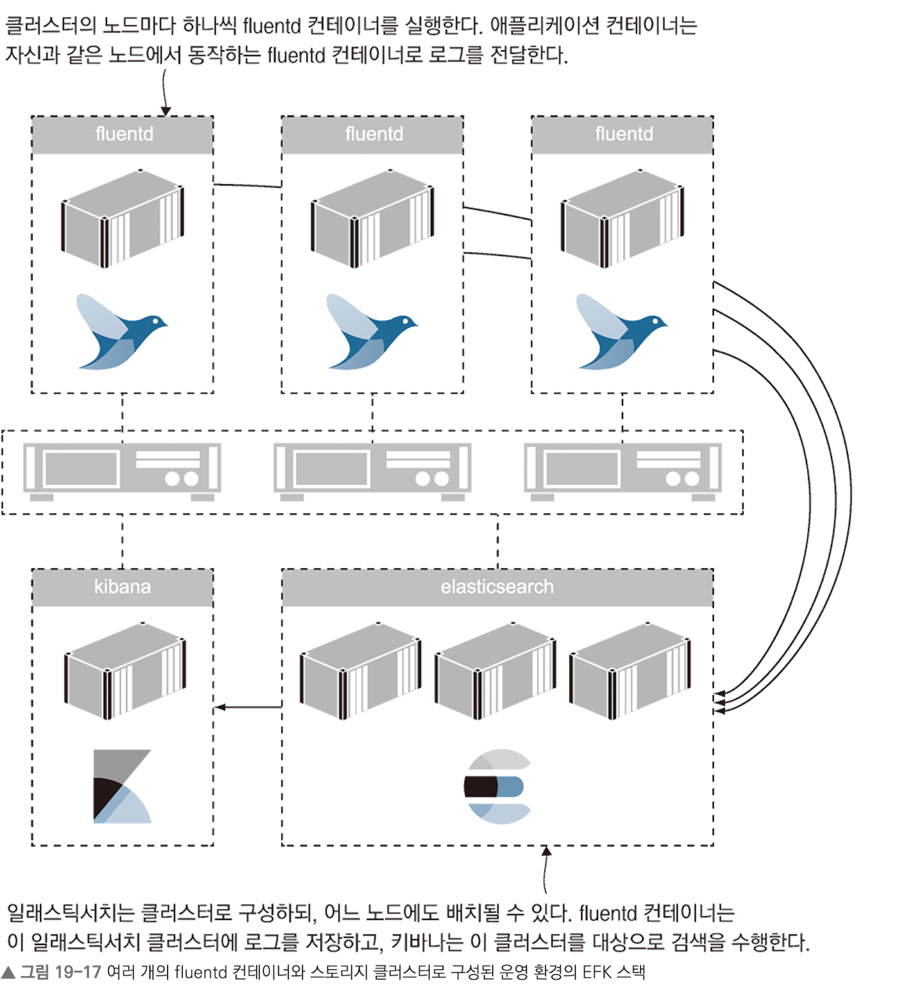

# 도커를 이용한 로그 생성 및 관리

## 최 혁

---

# 표준 에러 스트림과 표준 출력 스트림

- 실행된 프로세스에서 생성한 로그 엔트리는 표준 출력(stdout) 및 표준 오류(stderr) 스트림으로 출력된다.
- 도커는 각 컨테이너의 stdout과 stderr 스트림을 주시하며 스트림을 통해 출력되는 내용을 수집힌다.
- 터미널 세션과 분리된 컨테이너와 종료된 컨테이너의 로그를 수집할 수 있도록 로그를 JSON 파일로도 저장한다.(컨테이너와 동일한 생명주기를 가짐)

```shell
# 컨테이너 로그 파일 경로 확인
docker container inspect --format='{{.LogPath}}' timecheck
```

---

- JSON 형식으로 고려해야 할 때는 매우 많은 양의 로그가 생산되고, 이 로그를 일정 기간 분량을 관리할 수 있는 파일구조로 유지해야 할때 뿐이다.
- 컨테이너마다 기본적으로 JSON 로그 파일 하나가 생성되며 디스크 용량이 찰 때까지 크기가 증가한다.(롤링 설정 가능)
- 실행시 --log-opt max-size=5k, --log-opt max-file=3등으로 설정 가능하다.

---

# 다른 곳으로 출력된 로그를 stdout 스트림에 전달하기

- 컨테이너화하더라도 출력 스트림으로 아무 내용도 출력하지 않는 애플리케이션(윈도 서비스나 리눅스 데몬 형태의 애플리케이션)은 도커가 로그를 수집하지 못한다.
- 따라서 표준 출력 스트림이 아닌 채널을 사용해 로그를 출력하는 컨테이너는 로그 파일의 내용을 읽어 표준 출력으로 내부내주는 별도의 프로세스를 컨테이너 시작 명령에서 실행하면 된다.
- 이 프로세스는 컨테이너 시작 시퀀스에서 마지막으로 실행된 프로세스이기만 하면 셸 스크립트 또는 간단한 유틸리티 형태더라도 가능하다.
- 해당 방법은 로그 전달용 유틸리티가 포어그라운드로 동작하기에 컨테이너나 유틸리티 둘 중 하나라도 죽으면 같이 종료되기에 조심해야 한다.
- 디스크 사용 효율이 떨어진다는 단점이 있다.

---

```
# 로그 전달 유틸리티를 사용한 애플리케이션 빌드
FROM diamol/dotnet-runtime AS base
...
WORKDIR /app
COPY --from=builder /out/ .
COPY --from=utility /out/ .

FROM base AS linux
CMD dotnet TimeCheck.dll & dotnet Tail.dll /logs timecheck.log
```

해당 스크립트는 닷넷 애플리케이션을 백그라운드로 실행하고 닷넷 유틸리티 tail을 실행한다. tail은 로그 파일을 감시하다가 새로운 내용이 추가되면 그 때마다 stdout 스트림으로 전달해 컨테이너 로그로 수집되도록 한다.

---

# 컨테이너 로그 수집 및 포워딩하기

**fluentd와 같은 통합 로깅 계층 도구를 활용하여 다양한 곳에서 생성되는 로그를 모으고, 필터링과 가공을 거쳐 여러 대상으로 수집된 로그를 포워딩하는 역할을 한다.**

```shell
# fluentd 컨테이너 실행
docker container run -d -p 24224:24224 --name fluentd -v"~~" diamol/fluentd

# fluentd 로그 드라이버가 설정된 timecheck 애플리케이션 실행
docker container run -d --log-driver=fluentd diamol/ch19-timechecker:5.0
```

- 위와 같이 구성하면 fluentd가 애플리케이션 로그를 수집한다. 만약 수집한 로그를 stdout 스트림에 출력하도록 설정하면 timecheck 컨테이너의 로그를 볼 수 있다.
- 보통 fluentd에서 수집한 로그는 일라스틱서치 등의 로그 데이터 스토어로 보내고, 키바나같은 로그 검색 UI툴을 통해 조회하는 것이 일반적이다.

---

# 로그 출력 및 로그 컬렉션 관리하기

- fluentd의 설정에 따라 전략별로 다양한 곳에 로그를 저장할 수 있다.
- 성능과 관련된 가장 중요한 포넌트의 로그는 카프카, 사용자 로그는 일라스틱서치, 그 외의 로그는 S3에 저장하는 식으로 관리할 수 있다.

---


