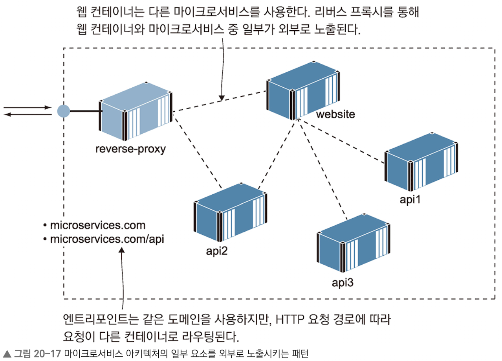
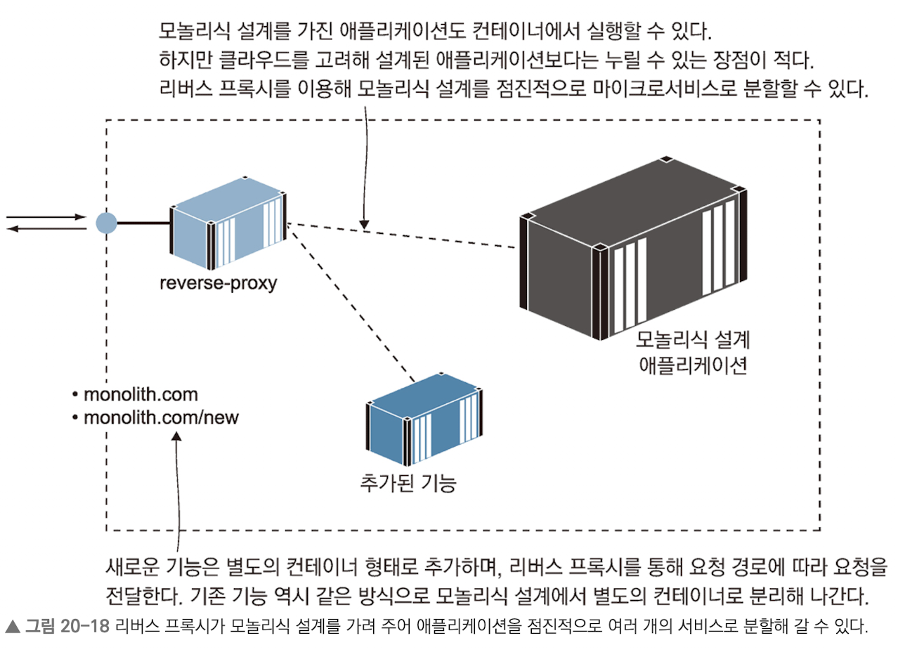

# 리버스 프록시를 이용해 컨테이너 HTTP 트래픽 제어하기

## 최 혁

---

# 리버스 프록시란?

- 도커엔진이 외부에서 들어온 트래픽을 컨테이너로 연결할 때 컨테이너가 주시할 수 있는 네트워크 포트는 하나 뿐이기에 이들을 모두 같은 포트를 통해 외부 네트워크에 접속 가능하도록 해야한다.
- 리버스 프록시를 통해 위 문제를 해결할 수 있다.
- 리버스 프록시는 여러 웹 애플리케이션으로 통하는 관문 역할을 하며 해당 트래픽이 어떤 애플리케이션에서 출발한 것인지 판단한다.
- 리버스 프록시를 사용하면 다른 애플리케이션 컨테이너는 포트를 외부에 공개하지 않아도 된다.

---

# nginx로 리버스 프록시 구현하기

1. docker network를 만들고 nginx와 애플리케이션을 띄운다.
2. 로컬 컴퓨터의 host 파일에 도메인을 추가한다.
   (echo $'127.0.0.1 whoami.local' | sudo tee -a /etc/hosts)
3. 애플리케이션 설정 파일을 엔진엑스 설정 파일 디렉터리로 복사
   (cp ./nginx/sites-available/whoami.local ./nginx/sites-enabled)
4. nginx 재실행

---

# 리버스 프록시의 라우팅과 SSL 적용

- 엔진엑스는 시작할 때 사이트별 설정 파일을 모두 읽은 다음 해당 설정을 업스트림이 모두 접근 가능한지 확인하고, 접근 가능하다면 호스트명과 IP 주소로 내부 라우팅 리스트를 만든다.
- 웹 애플리케이션 컴포넌트를 스케일링하면 늘어난 컨테이너 간의 로드 밸런싱을 엔진엑스가 처리해준다.
- nginx는 업스트림시 응답 헤더에 X-Upstream 항목을 추가하는데, 이는 엔진엑스가 응답을 받아온 컨테이너의 IP 주소가 담긴 항목이다.(ip 주소는 매 호출시 조금씩 바뀐다)
- nginx에 Let's Emcrypt나 실제 도메인 제공자나 서비스에서 발급한 실제 인증서를 설정에 포함하여 HTTPS를 제공할 수 있다.

---

# 프록시를 이용한 성능 및 신뢰성 개선

- nginx를 업스트림 애플리케이션에서 받아 온 컨텐츠를 메모리에 저장해 두었다가 같은 콘텐츠 요청에 대해 저장된 것을 반환하는 캐싱 프록시로 활용할 수 있다.
- 캐싱 프록시로 활용하면 요청 처리 시간을 줄일 수 있고, 트래픽을 줄일 수 있어 그만큼 인프라스트럭처로 더 많은 요청을 처리할 수 있다는 장점이 있다.
- nginx 프록시 설정에 사용자 정의 응답 헤더 X-Cache를 포함하여 요청에 해당하는 캐시가 있는지 먼저 확인하도록 한다.
- 만약 요청이 일치하는 캐시가 없다면 X-Cache: MISS가 나오고, X-Upstream 헤더에 콘텐츠를 제공한 컨테이너의 IP주소가 담긴다.
- 만약 요청에 일치하는 캐시가 있다면 X-Cache: HIT가 있고 X-Upstream이 없다.

---

# 클라우드 네이티브 리버스 프록시

- 클라우드 네이티브 리버스 프록시 도구인 Traefik을 사용하면 컨테이너 오케스트레이션 시스템과 통합되어 동적으로 서비스를 발견하고 관리할 수 있다.
- 너무 어렵습니다.. 이해가 안돼요

---

# 리버스 프록시가 있어야 적용할 수 있는 세 가지 패턴

1. 클라이언트 요청에 포함된 호스트명을 통해 HTTP or HTTPS로 제공되는 애플리케이션에서 정확한 콘텐츠를 제공하는 패턴

---

2. 한 애플리케이션이 여러 개의 컨테이너에 걸쳐 실행되는 MSA에서 주로 활용된다.(HTTP 요청의 경로를 이용해 마이크로서비스의 요소 중 일부만 선택적으로 노출)
   

---

3. 구식 모놀리식 설계를 가진 애플리케이션을 컨테이너로 이주시킬 때 특히 유용한 패턴

