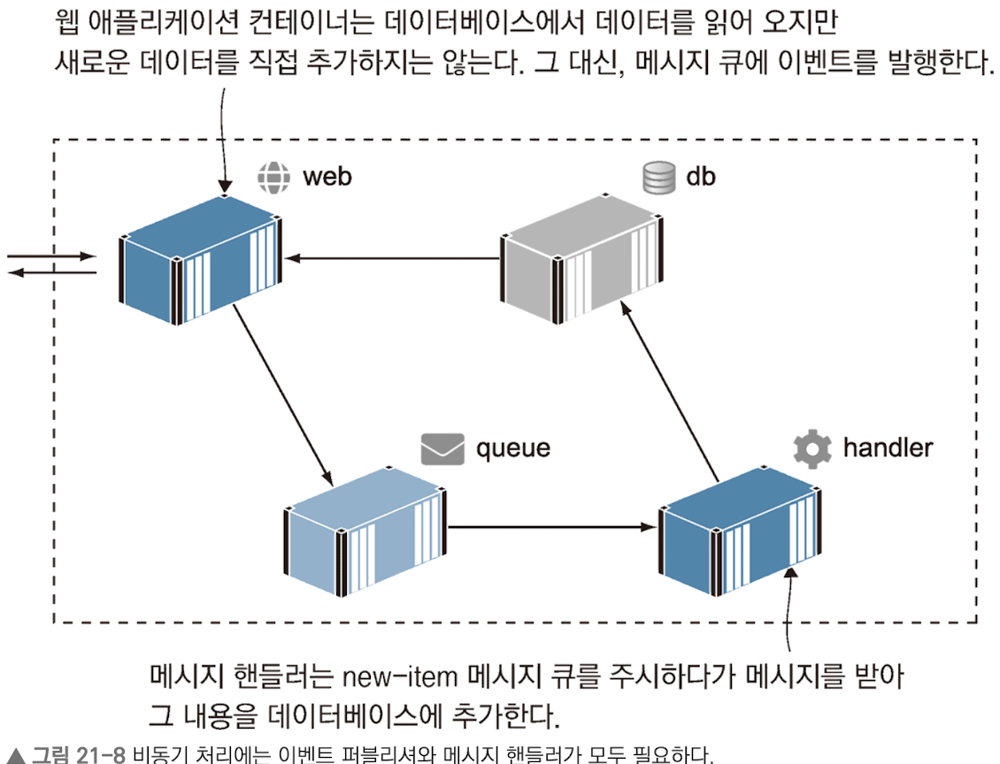
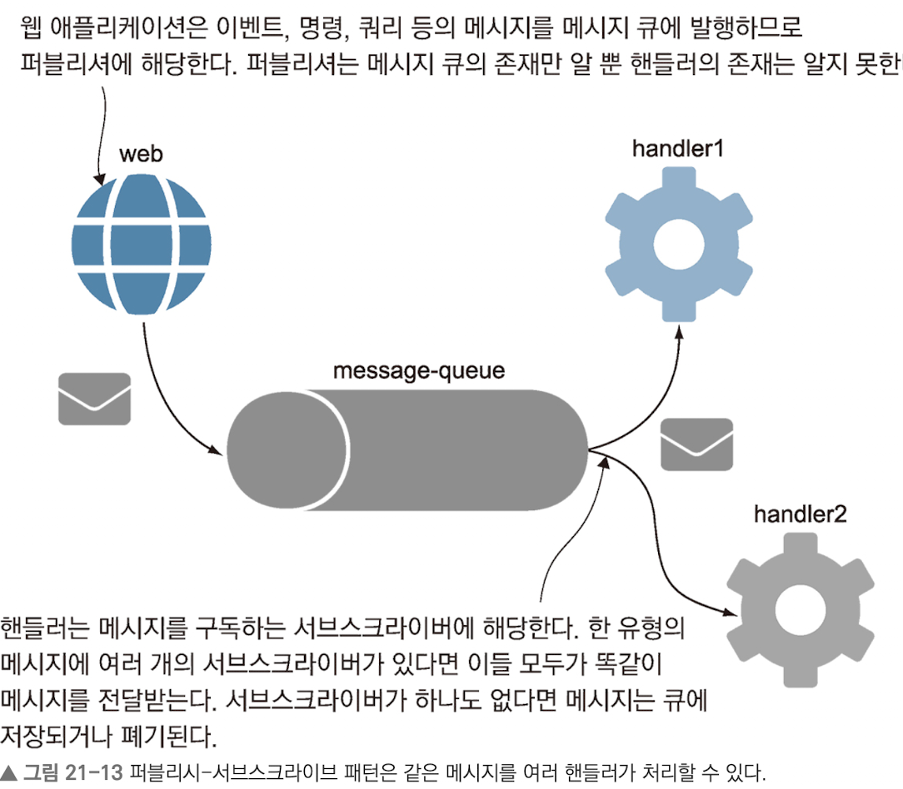
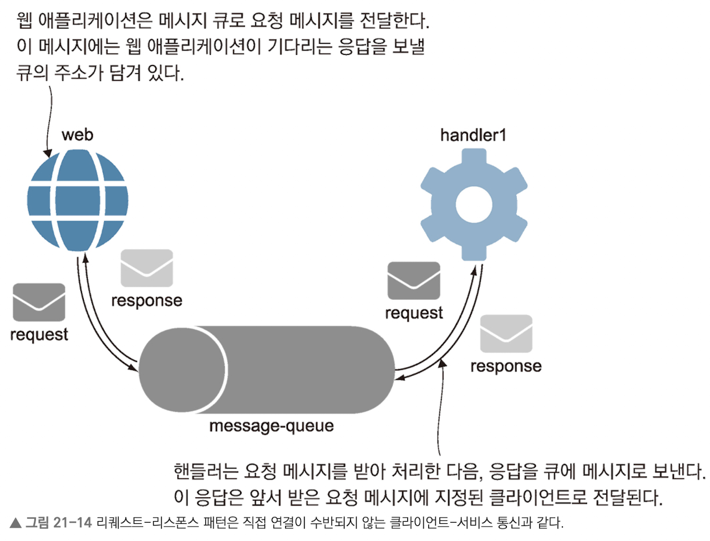

# 메시지 큐를 이용한 비동기 통신

## 최 혁

---

# 비동기 메시징이란?

- 메시지 큐를 이용하면 컴포넌트끼리 직접 메시지를 주고받는 방식과 비교해 컴포넌트 간의 결합을 느슨하게 하고 여러 대상에게 메시지를 보낼 수 있으며 유연하다.
- 비동기 통신은 클라이언트가 서버에 직접 요청을 보내는 대신 큐에 요청을 보낸다. 서버는 큐를 주시하다가 메시지를 수신하고 처리한 이후 응답 메시지를 큐로 보내고 클라이언트가 큐를 통해 응답을 수신한다.
- 도커를 사용하면 안정적인 오픈 소스 큐 시스템을 돌릴 수 있다.
- 용어 정리
  - publisher: 메시지를 보내는 컴포넌트
  - subscriber: 메시지를 받는 컴포넌트

---

# 비동기 통신의 특징

- publisher는 subscriber가 큐를 주시하기 전부터 메시지를 보낼 수 있다.
- subscriber는 publisher가 하나도 없더라도 큐를 주시할 수 있다.
- 메시지 큐를 다루는 컴포넌트는 같은 큐에서 메시지를 보내거나 받는 다른 컴포넌트의 존재를 알 수 없다.
- 이를 통해 메시지 전달자와 수신자의 결합을 느슨하게 하여 애플리케이션의 성능과 확장성을 개선할 수 있다.
- db에 접근할 때 메시지 큐를 도입하여 비동기 통신을 하게 되면 큐는 데이터베이스 서버의 커넥션 수보다 훨씬 많은 수의 퍼블리셔를 처리할 수 있으며, 필요한 접속의 지속 시간도 훨씬 짧다.

---

---

# 비동기 메시징에서 발생하는 부수효과: 결과적 일관성

- 모든 메시지의 처리가 끝나면 애플리케이션 데이터의 상태가 정확해지는데, 그 이전 시점에는 일관성이 깨질 수 있다.
- 웹 애플리케이션이 모든 메시지의 처리가 끝나고 할 일 목록이 갱신됐음을 의미하는 이벤트를 기다렸다가 그에 맞춰 화면을 리프레시하면 된다.(푸시 모델)
- 비동기 처리는 컨테이너 추가만으로도 스케일링이 가능하다. 메시지 큐는 큐에 접속한 모든 메시지 핸들러에게 고르게 메시지를 배분한다.

---

# 메시지 핸들러로 기능 추가하기

- event-driven architecture: 애플리케이션이 모든 일을 즉각 동기적으로 처리하는 대신 이벤트를 통해 다른 구성요소에 자신의 현재 상태를 알리는 방식
- 이벤트 지향 아키텍처는 이벤트를 발행하는 로직을 변경하지 않고도 이벤트 처리 로직을 바꿀 수 있으므로 애플리케이션의 구성 요소 간 결합도를 느슨하게 한다.
- 새 기능을 추가하는 가장 쉬운 방법은 새로운 메시지 핸들러의 그룹을 만들고 모든 메시지를 수신하도록 하되 이벤트 처리를 다르게 하는 것이다.

---

# 비동기 메시징 패턴 이해하기

- pub-sub patern: subscriber가 퍼블리시된 메시지를 구독하는 형태
  

---

- pub-sub 패턴은 퍼블리셔가 메시지를 사용하는 것이 누구이고, 어떻게 처리하며, 언제 처리가 끝나는지 알 방법이 없다.
- request-response 패턴을 사용하면 클라이언트가 메시지 큐에 메시지를 전달하고 응답을 기다리기에 해당 문제를 해결할 수 있다.

---

---

- 대부분의 메시지 큐 기술은 여러 패턴을 지원한다.
  - fire-and-forget: 클라이언트가 요청이 아닌 명령 메시지를 보내고 응답을 기다리지 않는 패턴
  - scatter-gather: 여러 subscriber에 메시지를 보낸 다음 이들로부터 응답을 모아 오는 패턴
